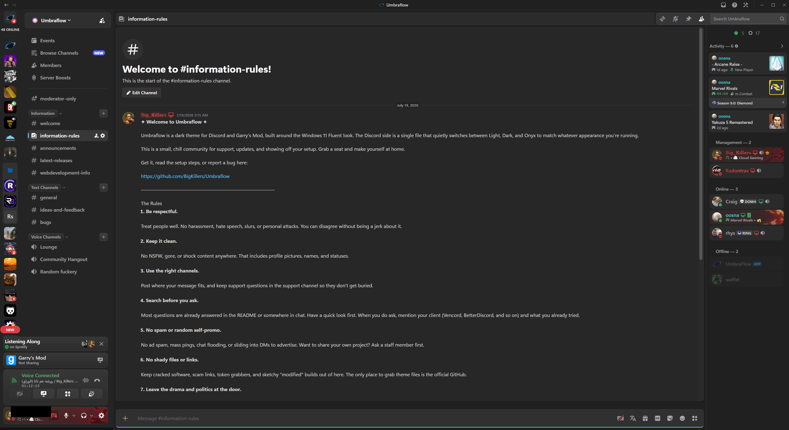
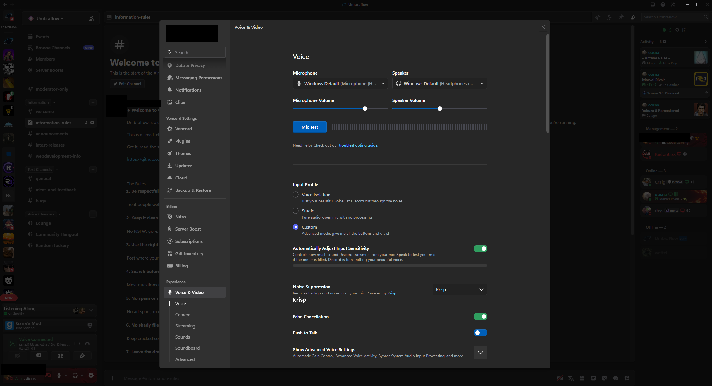

# Umbraflow

A dark theme for Discord and Garry's Mod, based on the Windows 11 Fluent look. Made from scratch.

| Platform | What it does |
|----------|----------------|
| Discord | Themes the whole client: chat, member list, panels, menus, and settings. One file that auto-switches between Light, Dark, and Onyx. |
| Garry's Mod | Themes the main menu, loading screen, VGUI scheme (console, dialogs, spawnmenu), and custom logos. |
| UmbraMotion | A Vencord plugin that animates Discord's UI: menus, modals, popouts, tooltips, messages and more, each spot configurable on its own. |

---

## Features

- Windows 11 Fluent styling: acrylic-style surfaces, rounded corners, and soft shadows.
- The Discord theme changes itself to match your Discord appearance (Light, Dark, or Onyx). You don't toggle anything.
- Discord and Garry's Mod share the same look.
- The Garry's Mod menu plays a soft hover sound when you mouse over the buttons.
- The Discord theme is a single file with everything inlined, so there are no extra assets to install.
- UmbraMotion adds enter animations to Discord on top of the theme, with style, speed, easing and direction settings for each part of the UI. Runs on Vencord, works with or without the theme.

---

## Screenshots

| Discord | Garry's Mod |
|---------|-------------|
| <br> |  |

---

## Discord

`Discord-Themes/umbraflow.theme.css` holds three palettes and picks one automatically based on your Discord appearance:

| Discord appearance | Palette |
|--------------------|---------|
| Light | Clean off-white with silvery cards |
| Dark  | Fluent dark (the default) |
| Onyx  | Near-black, OLED-friendly |

### Install

Download `Discord-Themes/umbraflow.theme.css` from this repo (or the [Releases](../../releases) page), then pick your client mod:

<details open>
<summary><strong>Vencord</strong></summary>

1. Install [Vencord](https://vencord.dev/).
2. Discord → **Settings** → **Vencord → Themes** → **Open Themes Folder**.
3. Drop `umbraflow.theme.css` into that folder.
4. Enable **Umbraflow** in the Themes list.

If you want it to update itself, skip the download and add this under **Themes → Online Themes** instead:
```
https://raw.githubusercontent.com/BigKillers/Umbraflow/main/Discord-Themes/umbraflow.theme.css
```
</details>

<details>
<summary><strong>Equicord</strong> (Vencord fork)</summary>

Same as Vencord: **Settings → Equicord → Themes → Open Themes Folder**, drop the file in, enable it.
</details>

<details>
<summary><strong>BetterDiscord</strong></summary>

1. Install [BetterDiscord](https://betterdiscord.app/).
2. Discord → **Settings** → **Themes** → **Open Themes Folder**.
3. Drop `umbraflow.theme.css` into that folder.
4. Toggle **Umbraflow** on in the Themes list.

The file has the metadata header BetterDiscord needs, so it shows up with its name and author.
</details>

> If it doesn't show up, reload Discord with **`Ctrl`/`Cmd` + R**, or toggle it off and on.

### Choosing the look

Go to **Settings → Appearance → Theme** and pick Light, Dark, or Onyx. Switch whenever you want and the palette changes right away. There's no separate Umbraflow setting.

### How the auto-switch works

Discord puts a class on the app for the current appearance (`theme-light`, `theme-dark`, or `theme-dark theme-midnight` for Onyx). Umbraflow ships all three palettes as CSS variables. Dark is the baseline, and two override blocks (`1b. THEME OVERRIDES`, at the bottom of the file) change only what's different for Light and Onyx. The layout is written once and shared by all three.

---

## UmbraMotion

The theme changes how Discord looks. UmbraMotion changes how it moves. It's a Vencord plugin that plays an enter animation when parts of the UI appear: switching servers or channels, opening menus and popouts, new messages coming in, tooltips, modals, and so on. Thirteen spots in total, and each one has its own style (fade, slide, blur, scale, or slip), duration, easing curve, and direction, so you can tune it or turn off the parts you don't want.

It also respects your OS reduced-motion setting out of the box, and there's a performance mode that disables the two heaviest animations if your machine stutters.

### Install

UmbraMotion is a userplugin, which means it runs on a Vencord built from source rather than the standard installer. Short version:

1. Clone [Vencord](https://github.com/Vendicated/Vencord) and run `pnpm install --frozen-lockfile`.
2. Copy the [`UmbraMotion/`](UmbraMotion/) folder from this repo into Vencord's `src/userplugins/`.
3. `pnpm build`, then `pnpm inject` (quit Discord fully first, from the tray icon).
4. Relaunch Discord and enable **UmbraMotion** under Settings → Vencord → Plugins.

The full walkthrough, plus how the plugin works and how to fix a selector if Discord renames a class, is in [UmbraMotion/README.md](UmbraMotion/README.md).

Works fine with or without the Umbraflow theme. They don't touch each other.

---

## Garry's Mod

The `Gmod-Theme/` folder mirrors your `garrysmod` directory. It has the main menu, loading screen, VGUI scheme (`resource/SourceScheme.res`), custom logos, and a hover sound for the menu buttons.

### Requires Chromium

Garry's Mod draws its menu with an embedded browser, and this theme leans on modern CSS (blur, variables, transitions) that only work on GMod's newer **Chromium** engine. On the old Awesomium engine the menu comes out broken and unstyled, so you have to put GMod on a Chromium branch before the theme will look right. It's a one-time Steam setting:

1. In Steam, right-click **Garry's Mod** → **Properties**.
2. Open the **Betas** tab.
3. In the beta dropdown, pick one:
   - **`x86-64`** — the 64-bit build, which runs Chromium by default. Go with this one unless you have a reason not to.
   - **`chromium`** — the 32-bit build with Chromium swapped in.
4. Close the window and let Steam download the update.
5. Launch Garry's Mod once so it's running on Chromium, then install the theme below.

No beta code is needed, both branches are public. If the menu ever shows up plain or half-styled, you're still on Awesomium and haven't switched branches yet.

### Install

**Back up your `garrysmod` folder first.** This replaces core menu files.

1. Open your GMod install, for example `...\Steam\steamapps\common\GarrysMod\garrysmod\`.
2. Copy the contents of `Gmod-Theme/` into that `garrysmod\` folder, merging and overwriting when asked. The `html/`, `resource/`, and `gamemodes/` folders each land in their matching folder.
3. Restart Garry's Mod.

To undo it, restore your backup or verify the game files through Steam.

### Menu sound

Hovering a menu button plays `sound/umbraflow/hover.wav`. Want your own sound? Drop a `.wav` in at that same path and keep the name, and it just works. A short 16-bit wav (mono, 44.1kHz) is the safe bet. If you'd rather point it somewhere else or turn it off, the hover line is at the bottom of `html/js/menu/control.Menu.js`.

---

## Customization

The Discord colors are all CSS variables. The Dark palette is the `:root` block near the top of `umbraflow.theme.css`. Light and Onyx are the two blocks under `1b. THEME OVERRIDES` at the bottom, and each one only lists what's different. Edit a value and reload. The layout rules read the variables, so one change applies to all three palettes.

---

## Community

Questions, updates, or want to show off your setup? Come hang out:

**[discord.gg/umbraflow](https://discord.gg/umbraflow)**

---

## Issues and contributions

Found a bug or have an idea? Open an [issue](../../issues). Pull requests are welcome, just keep things consistent with the Fluent look.

---

## License

Umbraflow is under the [MIT License](LICENSE). Use it, change it, and share it, just keep the attribution.

---

## Credits

Created by BigKillers (Discord: `Big_Killers`). Fluent design language from Microsoft / Windows 11. Discord Spotify glyph from [Simple Icons](https://simpleicons.org) (CC0).

Not affiliated with Discord, Microsoft, or Facepunch Studios.
